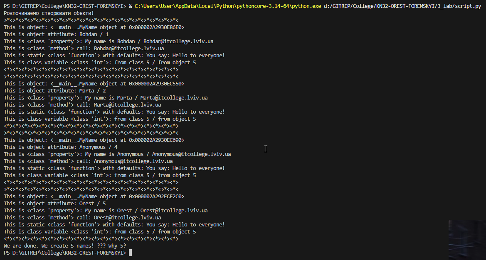

# Звіт до роботи
## Тема: Знайомство з ООП
### Мета роботи: Навчитись використовувати основні принципи ООП, розглянути кострукції побудови класу та створення обєктів та навчитись працювати з ними

---
### Виконання роботи
* Результати виконання завдання *1*;
    1. Програма вивела значення 
    * Отримано наступні результати   
    Створюються три обєкти класу MyName:
```text
        MyName("Bohdan")

        MyName("Marta")

        MyName(None) -> тут спрацює self.anonymous_user().name, і обєкт 
        отримає імя "Anonymous".

        Кожен раз змінна класу total_names збільшується на 1.

        Після створення всіх обєктів: MyName.total_names == 3.\
```
* Результати виконання завдання *2*;   
 1.Виконав приклади які розглядали на лекції: [Відкрити приклади](examples.ipynb)   
  2.Відрізняти функціональний підхід та ООП.

    * Створювати обєкти та динамічно додавати атрибути.

    * Використовувати методи та властивості (@property).

    * Застосовувати статичні та класові методи, альтернативні конструктори.

    * Робити взаємодію обєктів між собою через методи.

    * Використовувати (__str__, __len__) для зручності.

* Результати виконання завдання *3*;   
    Ознайомився з кодом та зрозумів за що відповідає кожен з рядків

* Результати виконання завдання *4*;    
    1.Модифікував програму додавши своє імя в список;   
    2. [47 рядок коду](script.py) 
* Результати виконання завдання *5*;    
    Номер підзавдання (1-9)
    1.  [Відповідь](Individual_tasks/1_task.txt)
    2.  [63 рядок коду](Individual_tasks/2_task.py) 
    3.  [41 рядок коду](Individual_tasks/3_task.py) 
    4.  [56 рядок коду](Individual_tasks/4_task.py) 
    5.  [9 рядок коду](Individual_tasks/5_task.py) 
    6.  [21 рядок коду](Individual_tasks/6_task.py) 
    7.  [11,51 рядок коду](Individual_tasks/7_task.py) 
    8.  [26 рядок коду](Individual_tasks/8_task.py) 
    9.  [36 рядок коду](Individual_tasks/9_task.py) 


---
### Висновок:


-  Що зроблено в роботі;    
        Створено клас, обєкти, методи та властивості в Python.
-  Чи досягнуто мети роботи;    
Так, досягнуто
-  Які нові знання отримано;        
Основи ООП, робота з класами, методами, властивостями та файлами.
-  Чи вдалось відповісти на всі питання задані в ході роботи;       
Так.
-  Чи вдалося виконати всі завдання;        
Так.
-  Чи виникли складності у виконанні завдання;          
Мінімальні.
-  Чи подобається такий формат здачі роботи (Feedback);     
Подобається.
-  Побажання для покращення (Suggestions);      
Відсутні.

---