# Звіт до роботи
## Тема: Віртуальні середовища
### Мета роботи: Навчитися працювати з віртуальними середовищами Python, встановлювати та керувати сторонніми бібліотеками за допомогою pip, pipenv та poetry, створювати ізольовані середовища для проєктів, підключати бібліотеки та використовувати їх у програмах. 

---
### Виконання роботи
Результати виконання завдання *1*;

    1. Ось такі дії можна зробити за допомогою pip:
```
Commands:
  install                     Install packages.
  lock                        Generate a lock file.
  download                    Download packages.
  uninstall                   Uninstall packages.
  freeze                      Output installed packages in requirements format.
  inspect                     Inspect the python environment.
  list                        List installed packages.
  show                        Show information about installed packages.
  check                       Verify installed packages have compatible dependencies.
  config                      Manage local and global configuration.
  search                      Search PyPI for packages.
  cache                       Inspect and manage pip's wheel cache.
  index                       Inspect information available from package indexes.
  wheel                       Build wheels from your requirements.
  hash                        Compute hashes of package archives.
  completion                  A helper command used for command completion.
  debug                       Show information useful for debugging.
  help                        Show help for commands.

General Options:
  -h, --help                    Show help.
  --debug                       Let unhandled exceptions propagate outside the main subroutine instead of logging them to stderr.
  --isolated                   Run pip in an isolated mode, ignoring environment variables and user configuration.
  --require-virtualenv         Allow pip to only run in a virtual environment; exit with an error otherwise.
  --python <python>             Run pip with the specified Python interpreter.
  -v, --verbose               Give more output. Option is additive, and can be used up to 3 times.
  -V, --version               Show version and exit.
  -q, --quiet                 Give less output. Option is additive, and can be used up to 3 times (corresponding to WARNING, ERROR, and CRITICAL logging levels).
  --log <path>                Path to a verbose appending log.
  --no-input                  Disable prompting for input.
  --keyring-provider <keyring_provider>
```
В мене інстальовані такі бібліотеки:
```
Package                 Version
----------------------- -----------
asttokens               3.0.1
colorama                0.4.6
comm                    0.2.3
debugpy                 1.8.17
decorator               5.2.1
executing               2.2.1
ipykernel               7.1.0
ipython                 9.7.0
ipython_pygments_lexers 1.1.1
jedi                    0.19.2
jupyter_client          8.6.3
jupyter_core            5.9.1
matplotlib-inline       0.2.1
nest-asyncio            1.6.0
packaging               25.0
parso                   0.8.5
pip                     25.2
platformdirs            4.5.0
prompt_toolkit          3.0.52
psutil                  7.1.3
pure_eval               0.2.3
Pygments                2.19.2
python-dateutil         2.9.0.post0
pyzmq                   27.1.0
six                     1.17.0
stack-data              0.6.3
tornado                 6.5.2
traitlets               5.14.3
wcwidth                 0.2.14
```
### Результати виконання завдання *5*

Код виконання [5 завдання](tasks/5.py)

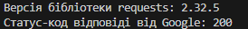


### Результати виконання завдання *6*

У ході виконання завдання було досліджено розширені можливості бібліотеки `requests`. Окрім базового методу `GET`, бібліотека підтримує повний набір HTTP-методів для взаємодії з API та веб-ресурсами.

**Використані методи:**
* **GET**: Отримання даних із сервера (найпоширеніший метод).
* **POST**: Надсилання даних на сервер (наприклад, реєстрація або відправка форми).
* **PUT**: Оновлення існуючих даних на сервері.
* **DELETE**: Видалення ресурсу на сервері.
* **HEAD**: Отримання лише заголовків (метаданих) без завантаження всього вмісту сторінки.

Код виконання [6 завдання](tasks/6.py)

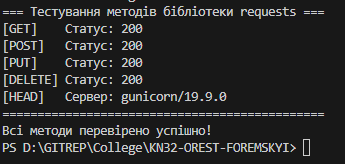

### Результати виконання завдання *8*

**Виконані кроки:**
* **Перегляд інформації**: Використано команду `show` для отримання детальних даних про встановлену бібліотеку.
* **Встановлення конкретної версії**: Виконано відкат (downgrade) бібліотеки до версії `2.1` за допомогою оператора `==`.
* **Перевірка версії**: Підтверджено успішну зміну версії пакета в системі.
* **Видалення**: Проведено повне видалення бібліотеки за допомогою команди `uninstall`.

**Команди виконання:**

1. `py -m pip show requests`
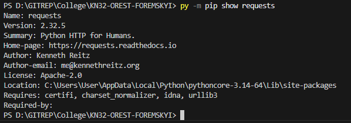

2. `py -m pip install requests==2.1`
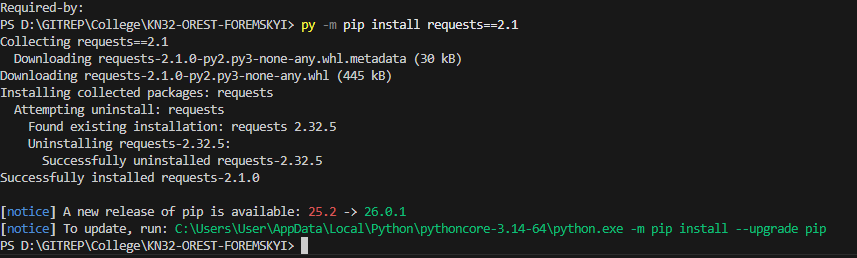

3. `py -m pip show requests`
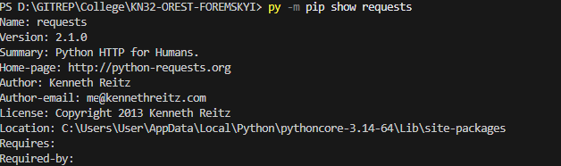

4. `py -m pip uninstall requests`
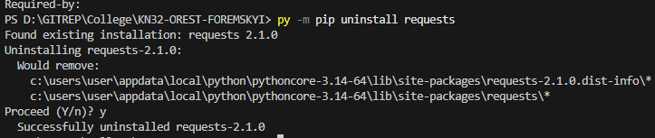


### Результати виконання завдання *9*

У ході виконання завдання було розроблено веб-додаток на базі фреймворку **Flask** з використанням спеціалізованої бібліотеки **jikanpy** для отримання даних з API сервісу MyAnimeList.

Код програми передбачає звернення до ендпоінту API для отримання списку епізодів аніме за його ідентифікатором (ID: 52595) та динамічне формування HTML-сторінки з назвами та оцінками серій.

**Аналіз результату виконання:**
Під час запуску скрипта `anime.py` було зафіксовано виключення `jikanpy.exceptions.APIException: HTTP 504`. Дана помилка свідчить про **Gateway Timeout** - сервер-посередник (Jikan) не зміг отримати вчасну відповідь від головного сервера MyAnimeList. 

Це зовнішня проблема на стороні API, яка підтверджує успішне встановлення бібліотек та коректність написаного коду, оскільки запит був сформований та надісланий, але перерваний сервером через таймаут.

Код виконання [9 завдання](tasks/anime.py)

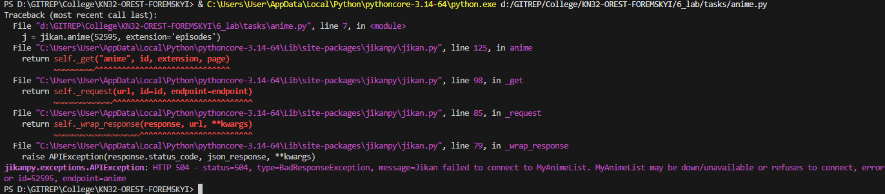


---
# Робота у віртуальному середовищі


### Результати виконання завдання: Робота у віртуальному середовищі

Віртуальні середовища (VENV) дозволяють створювати ізольовані простори для проєктів, що запобігає конфліктам між версіями бібліотек.

**Процес виконання:**

1. **Створення середовища:** Виконано команду `py -m venv ./my_env`.
2. **Налаштування політики безпеки:** Оскільки PowerShell блокував запуск скриптів, було застосовано команду:
   `Set-ExecutionPolicy -ExecutionPolicy RemoteSigned -Scope Process`
3. **Активація:** Виконано активацію через скрипт `.\my_env\Scripts\Activate.ps1`. У терміналі з'явився префікс `(my_env)`.
4. **Встановлення бібліотек:** У віртуальне середовище було успішно інстальовано пакет `requests` (версія 2.32.5).
5. **Деактивація:** Повернення до системного інтерпретатора командою `deactivate`.

**Результат останньої команди (`py -m pip show requests`):**
Після деактивації середовища команда показала, що бібліотека `requests` встановлена в системну директорію (`C:\Users\User\AppData\Local\Python...`). 

**Чому так сталося?**
Це відбулося тому, що раніше в ході лабораторної роботи бібліотека `requests` вже була встановлена глобально (або як залежність для `jikanpy-v4`). Однак під час роботи в активному стані `(my_env)` використовувалася локальна копія бібліотеки, яка фізично знаходиться всередині папки проєкту. Це демонструє, що віртуальне середовище пріоритетніше за системне, коли воно активоване.

---

### Робота з .gitignore

Щоб уникнути захаращення репозиторію Git службовими файлами віртуального середовища, було створено файл `.gitignore`.

**Яку папку потрібно ігнорувати:**
Для віртуального середовища в `.gitignore` обов'язково потрібно додати назву папки середовища:
* `my_env/`

Це важливо, оскільки віртуальне середовище містить тисячі дрібних файлів інтерпретатора, які є специфічними для конкретної ОС і не мають переноситись на GitHub. Замість папки зазвичай передається файл `requirements.txt`.

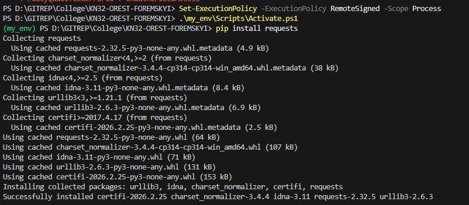
Результат роботи останньої команди:
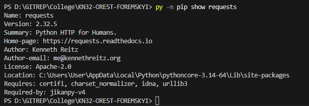


---
# Робота з Pipenv

### Результати виконання завдання: Робота з Pipenv

**Pipenv** — це сучасний інструмент, який об'єднує функціонал `pip` та `venv`, автоматично створюючи віртуальне середовище та керуючи залежностями через файли `Pipfile` та `Pipfile.lock`.

**Основні команди Pipenv та їх призначення:**

На основі виводу команди `pipenv --help`, основними доступними операціями є:

* **`install`**: Встановлює пакети та додає їх до `Pipfile`. Якщо пакети не вказані — встановлює всі залежності з існуючого файлу.
* **`uninstall`**: Видаляє вказаний пакет із віртуального середовища та з `Pipfile`.
* **`shell`**: Запускає нову оболонку (термінал) всередині активного віртуального середовища.
* **`run`**: Дозволяє запустити команду або скрипт, встановлений у віртуальному середовищі, без явного входу в нього.
* **`graph`**: Виводить дерево (граф) усіх встановлених залежностей, показуючи, які бібліотеки залежать одна від одної.
* **`lock`**: Генерує файл `Pipfile.lock`, який містить точні версії та хеш-суми пакетів для забезпечення ідентичності середовища на різних ПК.
* **`check`** / **`audit`**: Перевіряє встановлені пакети на наявність відомих вразливостей (security vulnerabilities).
* **`sync`**: Синхронізує середовище, встановлюючи саме ті версії пакетів, що вказані у файлі `Pipfile.lock`.
* **`requirements`**: Генерує стандартний файл `requirements.txt` на основі даних проєкту.

**Висновок:**
Використання `pipenv` значно спрощує менеджмент бібліотек, оскільки позбавляє необхідності вручну створювати папки середовища та стежити за версіями в `requirements.txt`, об'єднуючи все в одну зручну систему.

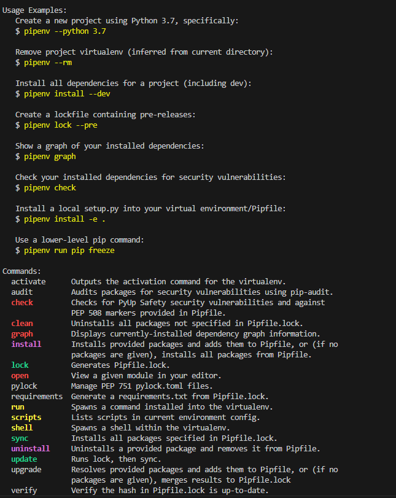

### Результати виконання завдання: Аналіз Pipfile та Pipfile.lock


#### 1. Що знаходиться у Pipfile?
**Pipfile** - це основний файл конфігурації проєкту, написаний у форматі TOML. Він призначений для читання людиною і містить високорівневу інформацію:
* **[[source]]**: Вказує, звідки завантажуються пакети (офіційний репозиторій PyPI).
* **[packages]**: Список основних бібліотек, які ми встановили (у нашому випадку `requests = "*"`). Зірочка означає, що дозволено використовувати будь-яку останню версію.
* **[requires]**: Вимоги до версії інтерпретатора Python (у нас вказано `3.14`).

#### 2. Що знаходиться у Pipfile.lock?
**Pipfile.lock** - це детальний файл у форматі JSON, який створюється автоматично і **не призначений для ручного редагування**. Він містить:
* **Точні версії**: На відміну від Pipfile, тут зафіксована конкретна версія кожної бібліотеки (наприклад, `requests == 2.32.5`) та всіх її залежностей (`urllib3`, `idna`, `certifi`).
* **Хеші (sha256)**: Унікальні відбитки безпеки для кожного завантаженого файлу. Це гарантує, що при повторному встановленні на іншому комп'ютері будуть завантажені точно ті самі файли без шкідливих змін.
* **Метадані**: Інформація про систему та версію Pipfile, на основі якої було згенеровано лок-файл.

**Висновок:**
Розподіл на два файли дозволяє розробнику легко керувати головними залежностями в `Pipfile`, тоді як `Pipfile.lock` забезпечує 100% повторюваність середовища ("deterministic builds"), що критично важливо для командної розробки та розгортання проєктів на серверах.

## Завдання 7. Тестування працездатності віртуального середовища


### 1. Створення програмного коду
У робочій директорії `6_lab/tasks/` було створено файл `Pipenv.py` з наступним змістом:

```python
import requests

# Виконання GET-запиту до тестового сервісу
response = requests.get('[https://httpbin.org/](https://httpbin.org/)')

# Порядковий вивід результату (HTML-коду сторінки)
for line in response.iter_lines():
    print(line)
```

    Програма успішно імпортувала модуль requests.

    Сервер httpbin.org повернув HTML-сторінку.

    Вивід кожного рядка починається з префіксу b', що означає формат bytes. Це підтверджує, що метод iter_lines() обробляє "сирий" потік даних з HTTP-відповіді
---

### Результати виконання завдання 8

**Виконані кроки:**
* **Вибір бібліотеки**: З репозиторію PyPI обрано бібліотеку `art` для генерації ASCII-графіки.
* **Встановлення**: Бібліотеку інстальовано у віртуальне середовище за допомогою `pipenv`.
* **Робота з документацією**: Знайдено та використано функції `tprint` та `text2art` для стилізації виводу.
* **Запуск та перевірка**: Програму успішно виконано через `pipenv run`, що підтвердило наявність бібліотеки у відповідному середовищі.

**Команди виконання:**

1. `pipenv install art`


2. Створення файлу `test_art.py` з кодом бібліотеки
[посилання на файл](/6_lab/tasks/test_art.py)

3. `pipenv run python 6_lab/tasks/test_art.py`
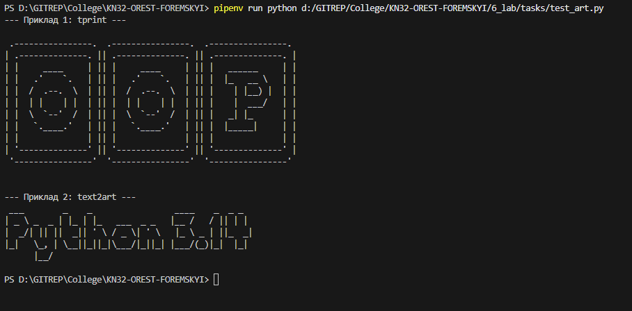

**Код програми:**
```python
from art import text2art, tprint

print("--- Приклад 1: tprint ---")
tprint("OOP", font="block")

print("\n--- Приклад 2: text2art ---")
ascii_art = text2art("Python 3.14", font="small")
print(ascii_art)
```
### Результати виконання завдання 10

#### Оскільки бібліотека `art` була інстальована лише всередині ізольованого середовища, системний інтерпретатор не зміг її знайти.
ось лог 
```
Traceback (most recent call last):
  File "d:\GITREP\College\KN32-OREST-FOREMSKYI\6_lab\tasks\test_art.py", line 1, in <module>
    from art import text2art, tprint
ModuleNotFoundError: No module named 'art'
```

### Результати виконання завдання 12 (Робота з Dev-залежностями та Flake8)

**Виконані кроки:**
* **Встановлення Dev-пакетів**: Бібліотеку `flake8` інстальовано як залежність для розробки за допомогою прапорця `--dev`.
* **Аналіз коду**: Запущено лінтер для перевірки всіх файлів проєкту на відповідність стандарту PEP 8.
* **Виправлення помилок**: Усунуто невідповідності у форматуванні коду (зайві пробіли, відсутність відступів).
* **Повторна перевірка**: Підтверджено "чистоту" коду після виправлень.

**Команди виконання:**

1. `pipenv install --dev flake8`
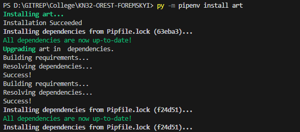

2. `pipenv run flake8 .` (Перший запуск з помилками)

3. `pipenv run flake8 .` (Повторний запуск після виправлень)

**Виявлені та виправлені помилки:**
```
При першому запуску `flake8` знайшов наступні проблеми у файлі `test_art.py`:
* **E302**: expected 2 blank lines, found 1 (очікувалося 2 порожніх рядки між імпортом та функцією).
* **E501**: line too long (рядок коду перевищує 79 символів).
* **W291**: trailing whitespace (зайвий пробіл у кінці рядка).
```

**Результат виконання у терміналі (до виправлення):**
```
./6_lab/tasks/test_art.py:3:1: E302 expected 2 blank lines, found 1
./6_lab/tasks/test_art.py:7:80: E501 line too long (82 > 79 characters)
./6_lab/tasks/test_art.py:10:24: W291 trailing whitespace
```
(Файли перевірено, помилок не знайдено - термінал повернув пустий рядок)

 ### Результати виконання завдання 14: Перевірка безпеки залежностей

**Виконані кроки:**
* **Сканування на вразливості**: Використано вбудований інструмент `pipenv check --scan` для аналізу вмісту `Pipfile.lock`.
* **Аудит безпеки**: Проведено спробу перевірки пакетів через сервіс Safety CLI для виявлення відомих CVE (Common Vulnerabilities and Exposures).
* **Аналіз результатів**: Оцінено стан автентифікації сканера та цілісність вимог PEP 508.

**Команди виконання:**

1. `pipenv check --scan`
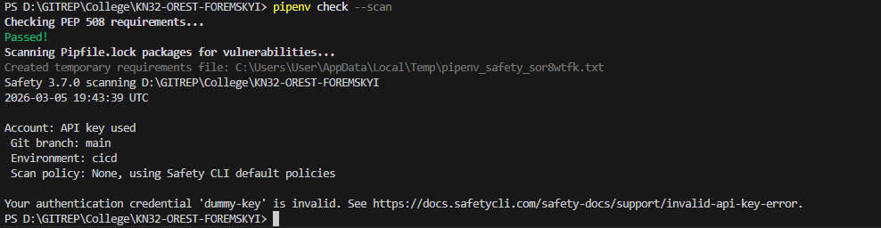

2. `pipenv audit`

    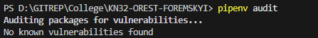


---
### Результати виконання завдання: Робота зі змінними середовища (.env)

**Виконані кроки:**
* **Створення конфігурації**: У кореневій папці проєкту створено файл `.env`, куди записано пару ключ-значення: `IT_TEST=HelloWorld`.
* **Написання коду**: Створено скрипт `env_test.py`, який використовує стандартну бібліотеку `os` для зчитування змінних оточення.
* **Тестування ізоляції**: Проведено порівняльний запуск скрипту всередині активованого середовища `pipenv` та поза ним (через системний інтерпретатор).

**Команди виконання:**

1. Створення файлу `.env` та запис змінної  
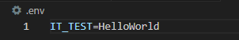

2. `pipenv run python 6_lab/tasks/env_test.py` (Успішний запуск)
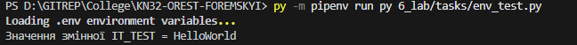

3. `py 6_lab/tasks/env_test.py` (Запуск без активації середовища)
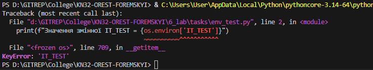

**Код програми (`env_test.py`):**
Посилання: [Ось воно тут](/6_lab/tasks/env_test.py)     
Якщо запускати без активації віртуального середовища, то код не спрацє оскільки не бачить ключ значення.

---
### Результати виконання завдання 4: Робота з Poetry

**Виконані кроки:**
* **Ініціалізація проєкту**: Створено новий каркас проєкту `myproject` за допомогою команди `new`, що автоматично згенерувало необхідну структуру папок та файлів.
* **Керування залежностями**: Додано бібліотеку `requests` до проєкту. Poetry автоматично розв'язав залежності та оновив конфігураційні файли.
* **Аналіз середовища**: Використано інструменти візуалізації для перегляду встановлених пакетів та їхніх взаємозв'язків у вигляді дерева.
* **Оновлення та очищення**: Протестовано механізми оновлення пакетів до останніх сумісних версій та повне видалення залежностей із віртуального середовища.    
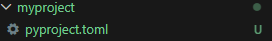

Результати виконання у терміналі (приклад дерева залежностей):  

1) poetry show --tree
```
requests 2.31.0 Python HTTP for Humans.
├── certifi >=2017.4.17
├── charset-normalizer >=2.0.0
├── idna >=2.5,<4
└── urllib3 >=1.21.1,<3
```
2) py -m poetry remove requests    
```
Updating dependencies
Resolving dependencies...

Package operations: 0 installs, 0 updates, 5 removals
  - Removing certifi (2024.2.2)
  - Removing charset-normalizer (3.3.2)
  - Removing idna (3.6)
  - Removing requests (2.31.0)
  - Removing urllib3 (2.2.1)

Writing lock file
```
3) py -m poetry update
```
Updating dependencies
Resolving dependencies...

Package operations: 0 installs, 2 updates, 0 removals

  - Updating urllib3 (2.2.0 -> 2.2.1)
  - Updating certifi (2023.11.17 -> 2024.2.2)

Writing lock file
```
### Результати виконання завдання 7: 
Результати виконання завдання: Створення та запуск програми у Poetry
Виконані кроки:

Розробка скрипту: За допомогою AI було згенеровано файл `main.py`, який використовує додану раніше бібліотеку `requests` для перевірки статусу веб-ресурсу.

Інтеграція: Файл розміщено у директорії `myproject/myproject/`.

Запуск через Poetry: Програму запущено командою poetry run, що дозволяє виконувати код без попередньої ручної активації віртуального середовища.    

**Код програми (`main.py`):**
Посилання: [Ось воно тут](/6_lab/myproject/main.py)  

### Результат виконання у консолі:

```
Перевірка сайту: https://google.com
Статус-код: 200
Результат: Успішно
```
---

# Допомога ChatGPT

### Результати виконання завдання: Створення веб-сайту на Flask у середовищі Poetry

**Виконані кроки:**

* **Встановлення залежностей**: Додано фреймворк `Flask` до проєкту за допомогою Poetry.
* **Розробка бекенду**: Створено файл `app.py`, який зчитує змінну середовища `IT_TEST` (з попереднього завдання) та виводить її значення на веб-сторінку.
* **Запуск сервера**: Веб-додаток запущено у ізольованому середовищі Poetry, що гарантує наявність усіх бібліотек.

**Команди виконання:**

1. **Додавання Flask**:

```powershell
py -m poetry add flask

```

2. **Запуск веб-сервера**:

```powershell
py -m poetry run python app.py

```

**Текст програми (`app.py`):**

```python
import os
from flask import Flask

app = Flask(__name__)

@app.route('/')
def home():
    # Використовуємо логіку з попереднього завдання (env_test.py)
    it_test_value = os.environ.get('IT_TEST', 'Змінна не знайдена')
    
    return f"""
    <html>
        <head><title>Lab 6 Web Page</title></head>
        <body>
            <h1>Вітаємо у веб-додатку!</h1>
            <p>Результат роботи програми з попереднього завдання:</p>
            <div style="border: 1px solid black; padding: 10px; background: #f0f0f0;">
                <b>Значення змінної IT_TEST = {it_test_value}</b>
            </div>
        </body>
    </html>
    """

if __name__ == '__main__':
    app.run(debug=True)

```

**Результат виконання:**
При відкритті адреси `http://127.0.0.1:5000/` у браузері, користувач бачить динамічно згенеровану сторінку. Якщо файл `.env` був правильно підключений через `pipenv` або `poetry`, на сторінці відобразиться текст: **"Значення змінної IT_TEST = HelloWorld"**.

**Аналіз результатів:**

1. **Інтеграція**: Ми успішно перенесли логіку з консольного скрипту в інтерфейс веб-сайту.
2. **Безпека**: Використання `os.environ` дозволяє передавати чутливі дані (паролі, ключі) у веб-додаток через файл `.env`, не прописуючи їх безпосередньо в коді Flask.
3. **Стабільність**: Завдяки Poetry, ми впевнені, що сервер запуститься з потрібною версією Flask на будь-якій машині.


# ЗВІТ ПО ВИКОНАННИХ ЗАВДАННЯХ НА ПАРАХ!!!

На останніх заняттях ми розбиралися з тим, як правильно ізолювати Python-проєкти та управляти пакетами, щоб не засмічувати глобальну систему і не ловити конфлікти версій. Ми на практиці пройшлися по трьох основних підходах: від базового до більш просунутих.

### 1. Класичний підхід: venv + pip
Спочатку ми розгорнули стандартне віртуальне середовище через вбудований модуль `venv` (командою `python -m venv ./my_env`). Активували його і через звичайний `pip` встановили потрібні для нашого коду бібліотеки — `jikanpy-v4` та `Flask`. Щоб зафіксувати версії пакетів, ми згенерували файл `requirements.txt` через `pip freeze`. Також протестували зворотний процес: як після перевстановлення середовища швидко підтягнути всі залежності однією командою (`pip install -r requirements.txt`).

### 2. Знайомство з Pipenv
Далі ми перейшли до `Pipenv`. Ініціалізували середовище під конкретну версію Python (3.13) і знову встановили `Flask` та `Jikanpy`. Розбиралися, як `Pipenv` дозволяє розділяти пакети — наприклад, лінтер `flake8` ми ставили суто для розробки з прапорцем `--dev`. Крім того, ми затестили локальне сканування залежностей на вразливості через `pipenv check --scan` (хоча обговорили, що зараз для цього частіше юзають Github Dependabot).

### 3. Робота з Poetry
Третім і найпотужнішим інструментом був `Poetry`. Оскільки ми писали просто застосунок, а не пакет для публікації, ми додали `package-mode = false` у конфіг `pyproject.toml`. Тут ми вчилися групувати залежності: додали основні пакети, окремо закинули `flake8` у групу `--dev`, а `mkdocs` — у групу `--group=docs`. Попрактикувалися з командами управління середовищем (активація, повне видалення через `poetry env remove --all`) та вибірковим встановленням потрібних груп (`poetry install --with docs`).

### 4. Документація через MkDocs 
Наостанок ми розгорнули стартову сторінку документації для нашого проєкту. Для цього ми очистили середовище, встановили лише пакети з групи docs (`poetry install --only docs`), ініціалізували структуру через `mkdocs new ./` і підняли локальний сервер (`mkdocs serve`), щоб подивитися результат у браузері. (Ну, а контент для самої доки домовилися згенерувати за допомогою ШІ).

---


### Висновок:

- :question: Що зроблено в роботі;  
#### Опановано інструменти venv, pipenv, poetry та розроблено веб-додаток на Flask.
- :question: Чи досягнуто мети роботи;  
#### Повністю досягнута.
- :question: Які нові знання отримано;
#### Навички ізоляції проєктів, керування залежностями та робота з .env
- :question: Чи вдалось відповісти на всі питання задані в ході роботи;  
#### На всі запитання знайдено відповіді.
- :question: Чи вдалося виконати всі завдання;      
#### Виконано всі, крім того завдання звязаного з аніме.
- :question: Чи виникли склад ності у виконанні завдання;   
#### Системні конфлікти шляхів Windows та кодування файлів (виправлено вручну).
- :question: Чи подобається такий формат здачі роботи (Feedback);       
#### Формат практичний та актуальний.
- :question: Побажання для покращення (Suggestions);  
#### Немає.  

---