# Звіт до роботи
## Тема: _AI Агенти з Google ADK_
### Мета роботи: _Навчитись створювати AI агентів з використанням Google ADK (Python) та Poetry для управління залежностями проекту_

---
### Виконання роботи 
### *Завдання номер 1. Підготовка робочого середовища*; 

1. Створив API ключ та зберіг його в .env який добавив в гіт ігнор файл.
1. Перевірив версії пайтона та Poetry: 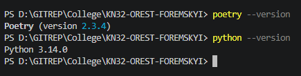
### *Завдання номер 2. Встановлення Google ADK*; 
1. Файл **poetry.lock**  був створений. Файл **poetry.lock** фіксує точні версії всіх встановлених пакетів та їхніх залежностей. Це гарантує відтворюваність проекту: кожен, хто завантажить код, отримає ідентичне середовище.
1. ADK Було встановлено коректно, версія яка встановлена: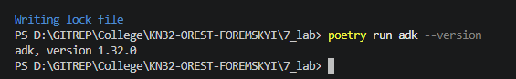
1. Основні команди: 
```
create = Creates a new app in the current folder with prepopulated agent template.
run = Runs an interactive CLI for a certain agent.
web = Starts a FastAPI server with Web UI for agents.
```
### *Завдання номер 3. Створення першого проекту з агентом*; 
1. Cтруктурa створеного проект: 

### *Завдання номер 4. Створення простого агента з інструментом*;

1. Що таке Agent клас?  

Це основний об'єкт фреймворку ADK, який представляє інтелектуального помічника. Він об'єднує велику мовну модель (LLM), інструкції (System Prompt), опис ролі та доступні інструменти в одну логічну одиницю для виконання конкретних завдань.

2. Для чого потрібен параметр tools?     

Цей параметр дозволяє "розширити" можливості нейромережі. Оскільки LLM сама по собі не має доступу до реального світу (інтернету, датчиків, системного часу), через tools ми надаємо агенту список Python-функцій, які він може викликати, коли йому потрібні точні зовнішні дані.

3. Що робить функція get_current_time?  

Це конкретний "інструмент" агента. Вона отримує назву міста як аргумент, за допомогою бібліотеки datetime дізнається поточний системний час і повертає його у вигляді структурованого словника (dict). Агент використовує цей результат, щоб надати користувачеві актуальну відповідь. 

### *Завдання номер 5. Запуск агента через командний рядок*; 
1. Запустив агента через командний рядок
2. На запитання яка година у Львові відповідь була ось така: 
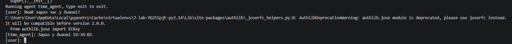
3. Ще 2 запитання:
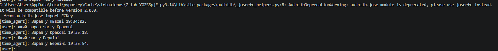

### *Завдання номер 6. Запуск агента через веб-інтерфейс*;
1. Cкріншот веб-інтерфейса, де я поставив запитання: 
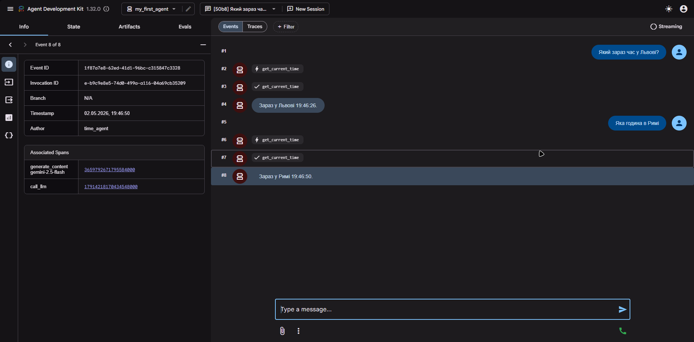

### *Завдання номер 7. Створення агента з математичними інструментами*;
1. Протестував агента запитаннями ось результат:
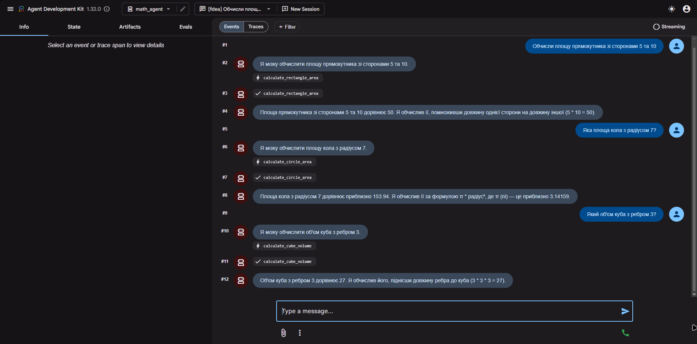
2. Добавив ще один інструмент який рахує площу трикутника 
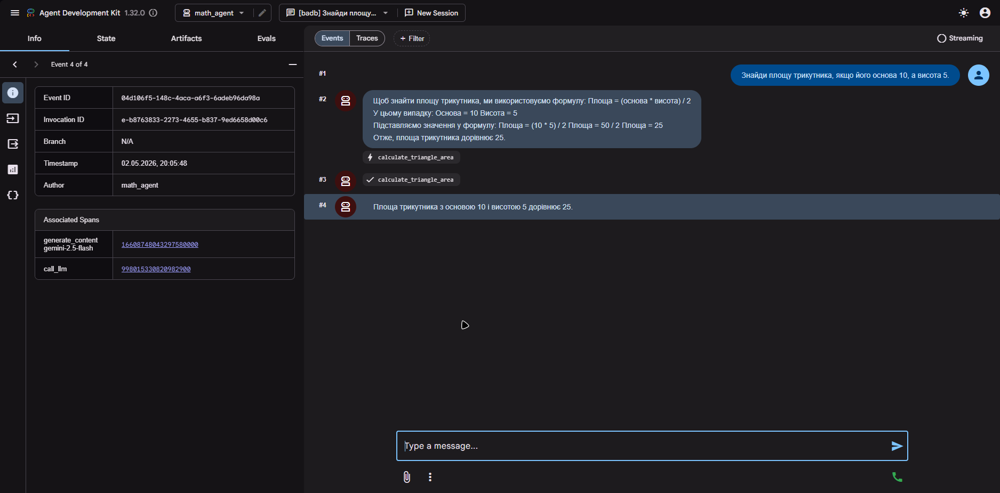

### *Завдання номер 8. Створення агента-помічника для студентів*;
1. Створив агента, та поставив йому запитання про пайтон:
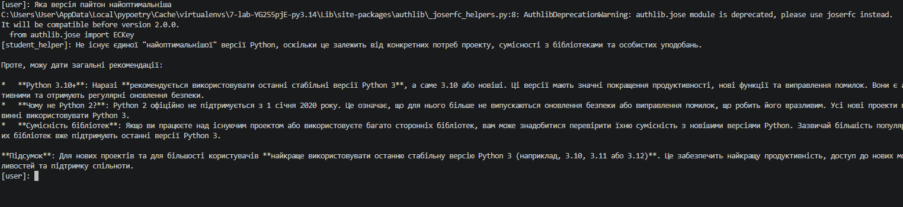
2. Протестував агента ще наступними запитаннями:
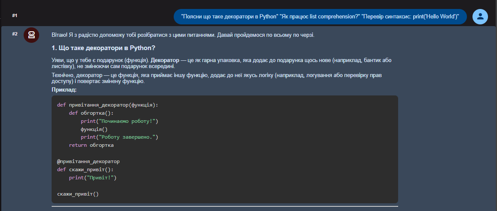
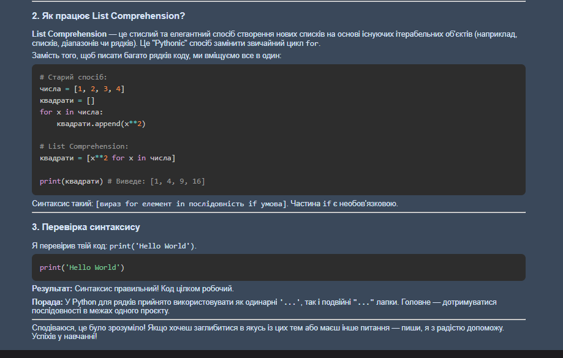

### *Завдання номер 9. Робота з конфігурацією агента*;

1. "Напиши коротку історію про подорож у космосі":
«Корабель "Іо" не летів — він прошивав простір, наче голка розпечений шовк. Капітан Еліас дивився у ілюмінатор, де зорі розмивалися у довгі неонові нитки. Це не була просто подорож до туманності Андромеди; це була втеча від тиші, що панувала на Землі. Раптом навігатор спалахнув фіолетовим: попереду виникла аномалія, схожа на розквітлу скляну квітку розміром з планету. Еліас посміхнувся — нарешті всесвіт вирішив з ним заговорити мовою хаосу».

2. "Казка про дружбу робота та людини":

«У місті іржавих дахів жив Марк — хлопчик з серцем, повним креслень. Його єдиним другом був Р-40, старий робот-сортувальник, чиї окуляри-сенсори постійно блимали теплим помаранчевим світлом. Одного разу Р-40 запитав: "Марку, що таке сльоза? Це збій у гідравліці?". Хлопчик приклав долоню до холодного металу грудей робота і відповів: "Ні, друже, це коли твоя внутрішня програма відчуває забагато краси". Робот зашумів вентиляторами, і в ту мить його пам'ять назавжди зберегла цей "збій" як найцінніший файл».

### *Завдання номер 10. Пояснення параметрів моделі*;


1. Агент-експерт
Налаштування: temperature=0.1, top_k=5, top_p=0.8.

Відповідь:
Ідеальна подорож — це логістично вивірений процес, що базується на ретельному плануванні. Вона включає: чітко визначений маршрут, заздалегідь заброньоване житло з високим рейтингом та оптимізований бюджет. Ключовими факторами успіху є безпека, наявність медичного страхування та мінімізація часових витрат на переміщення між локаціями. Мета такої подорожі — досягнення запланованих результатів (відвідування конкретних об'єктів) з нульовою ймовірністю непередбачуваних ситуацій.

2. Агент-асистент
Налаштування: temperature=0.7, top_k=25, top_p=0.95.

Відповідь:
Ідеальна подорож — це баланс між комфортом та новими враженнями. Це може бути тиждень у затишному містечку Європи, де ви маєте список цікавих музеїв, але також залишаєте час для неспішної кави на площі. Головне — це приємна компанія або внутрішній спокій, якщо ви подорожуєте наодинці. Така поїздка повинна перезавантажити ваші думки, дати можливість побачити красу іншої культури та повернутися додому з приємними спогадами та новими силами.

3. Агент-письменник
Налаштування: temperature=1.3, top_k=40, top_p=1.0.

Відповідь:
Ідеальна подорож — це стрибок у невідомість, де замість карти ви використовуєте власну інтуїцію. Це мить, коли ви опиняєтесь на покинутому вокзалі десь під зоряним небом Марокко, а вітер пахне шафраном та відлунням давніх міфів. Це розмови з випадковими зустрічними, чиї історії змінюють вашу ДНК. Це не про кілометри, а про глибину занурення: коли ви розчиняєтесь у шумі океану або в тиші соснового лісу, відчуваючи себе не туристом, а частиною великої космічної вистави.

Чим вища temperature, тим більше AI відхиляється від стандартних фраз, створюючи унікальний, але менш точний текст


### *Завдання номер 11. Створення агента з пам'яттю (збереження контексту)*;
1. Все вдало було виконано і ось перевірка: 
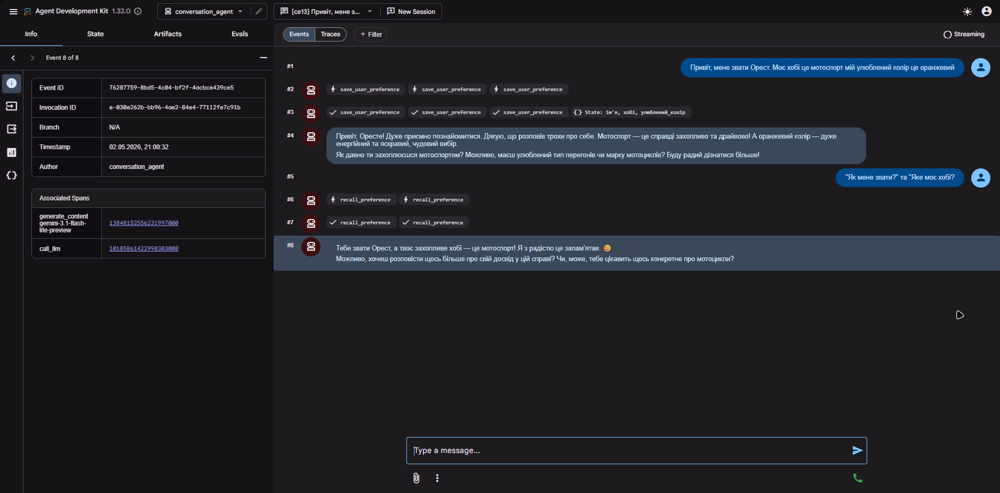
 
### *Завдання номер 12. Налагодження та тестування агентів*;
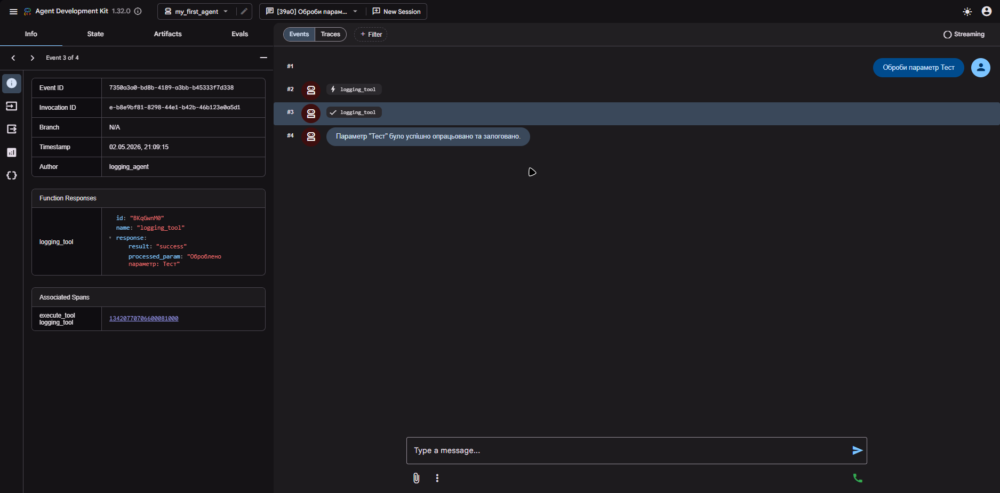

### *Завдання номер 13. Робота зі структурою проекту*;
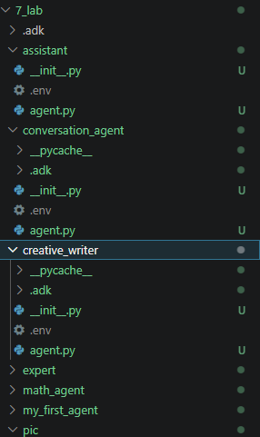
1. Добавив тулзи до my_first_agent. Все чудово працює

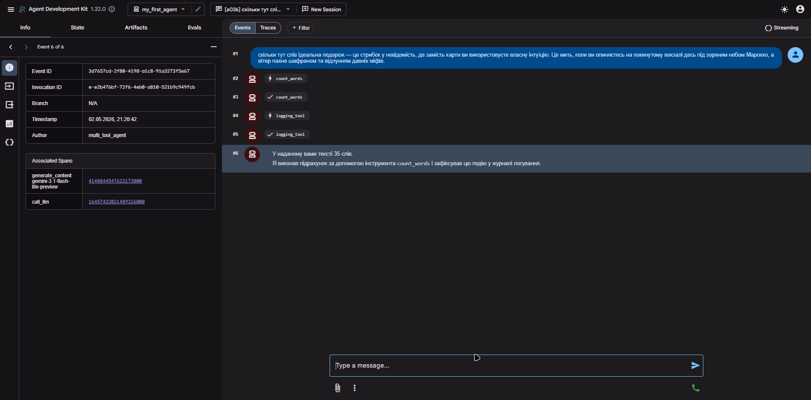

### *Завдання номер 14. Поради щодо створення ефективних агентів*;

``` python 
import logging
from google.adk.agents.llm_agent import Agent

# Налаштування логування для відстеження роботи
logging.basicConfig(level=logging.INFO)
logger = logging.getLogger("MathAgent")

def safe_divide(a: float, b: float) -> dict:
    """
    Виконує безпечне ділення двох чисел з перевіркою на нуль.

    Args:
        a (float): Чисельник (число, яке ділимо).
        b (float): Знаменник (число, на яке ділимо).

    Returns:
        dict: Словник з результатом або повідомленням про помилку.
    """
    logger.info(f"Виклик safe_divide: {a} / {b}")
    if b == 0:
        return {"error": "Ділення на нуль неможливе", "result": None}
    return {"result": a / b, "error": None}

def calculate_percent(value: float, percent: float) -> dict:
    """
    Обчислює відсоток від числа.

    Args:
        value (float): Базове число.
        percent (float): Відсоток, який потрібно знайти (наприклад, 10 для 10%).

    Returns:
        dict: Результат обчислення.
    """
    logger.info(f"Виклик calculate_percent: {percent}% від {value}")
    result = (value * percent) / 100
    return {"value": value, "percent": percent, "result": result}

root_agent = Agent(
    model='gemini-3.1-flash-lite',
    name='finance_assistant',
    description="Агент для точних фінансових та математичних розрахунків.",
    instruction="""
    Ти — професійний математичний асистент. Твоє завдання — допомагати користувачу з розрахунками.
    
    ПРАВИЛА РОБОТИ:
    1. Для будь-якого ділення ЗАВЖДИ використовуй інструмент safe_divide.
    2. Для розрахунку відсотків використовуй calculate_percent.
    3. Якщо інструмент повертає помилку (наприклад, ділення на нуль), ввічливо поясни це користувачу.
    4. Відповідай виключно українською мовою.
    5. Використовуй формат Markdown для оформлення чисел (наприклад, **результат: 25**).
    
    Будь точним і лаконічним.
    """,
    tools=[safe_divide, calculate_percent],
)
```
#### Чому обрані такі інструменти?   

safe_divide з валідацією: Я обрав цей інструмент, бо він демонструє обробку помилок прямо в коді. Це запобігає "галюцинаціям" AI, коли він міг би спробувати поділити на нуль самостійно. Повернення словника (dict) дозволяє агенту чітко розрізнити успіх та помилку.

Докладні Docstrings: Кожен параметр (a, b, value) описаний з вказанням типу даних. Це критично для ADK, оскільки агент використовує ці описи, щоб зрозуміти, які дані йому потрібно витягнути з повідомлення користувача.

#### Чому обрані такі інструкції?   

Рольова модель: Вказання "Ти — професійний математичний асистент" задає тон спілкування — серйозний та точний.

Алгоритм дій: Чіткі пункти ("ЗАВЖДИ використовуй...", "Якщо помилка...") обмежують творчість моделі там, де потрібна математична точність. Це імітує низьку температуру (temperature), роблячи агента надійним.

Форматування: Вимога використовувати Markdown та українську мову забезпечує однакову та зручну для читання структуру відповідей для звіту.

### *Завдання номер 15. Розширене завдання: Агент з збереженням стану*;
1. Перший запуск:
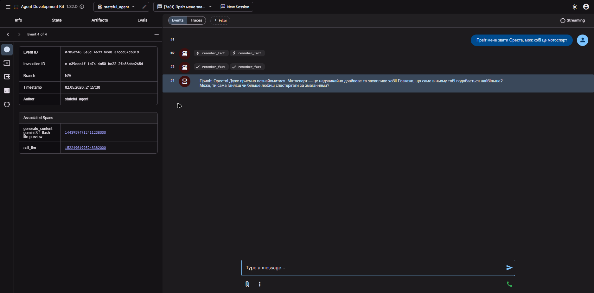
2. Другий запуск:
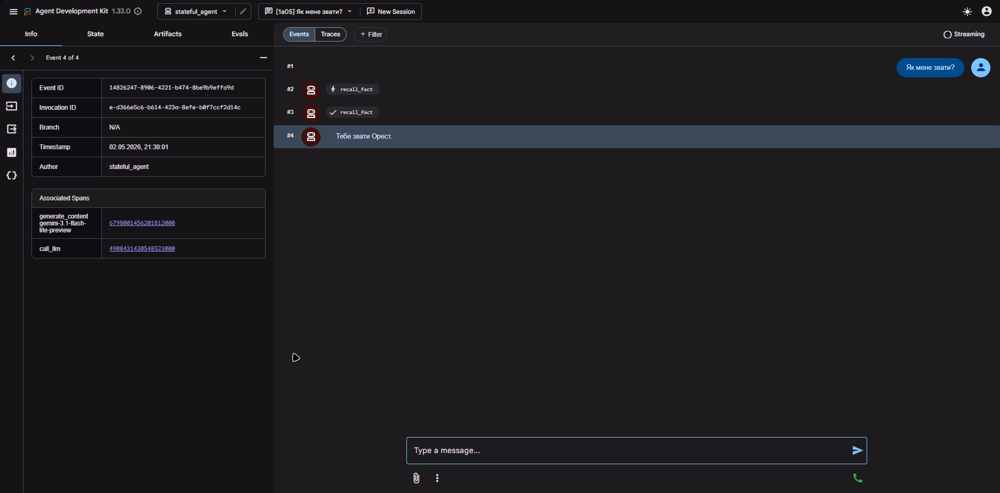
Все працює ідеально, бот все запамятав.

### *Завдання номер 16. Workflow Агенти - Sequential, Loop, Parallel*;
### Sequential Agent - Послідовне виконання
1. Створив агента та протестував ось результати:
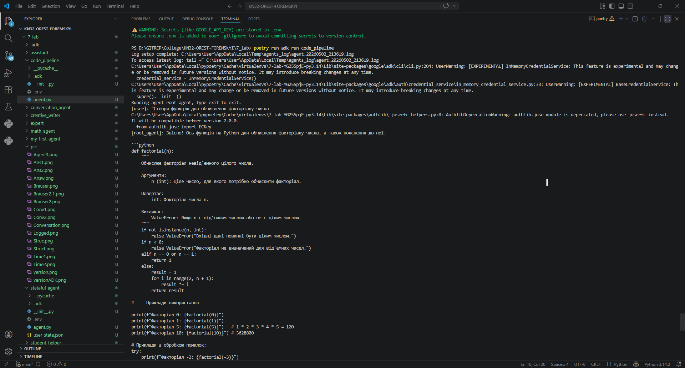
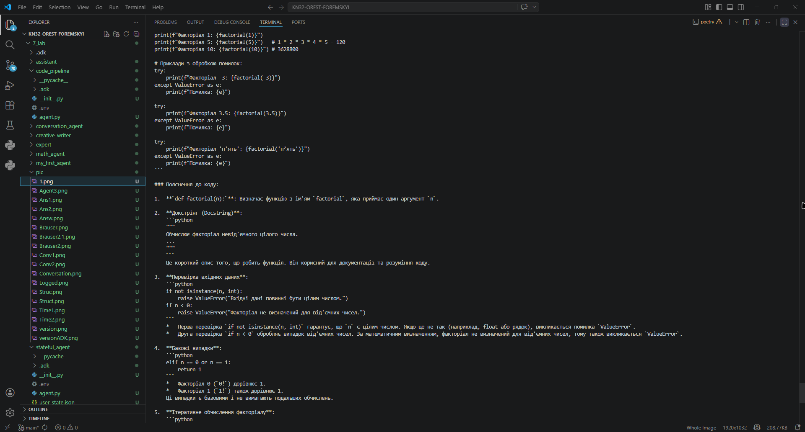
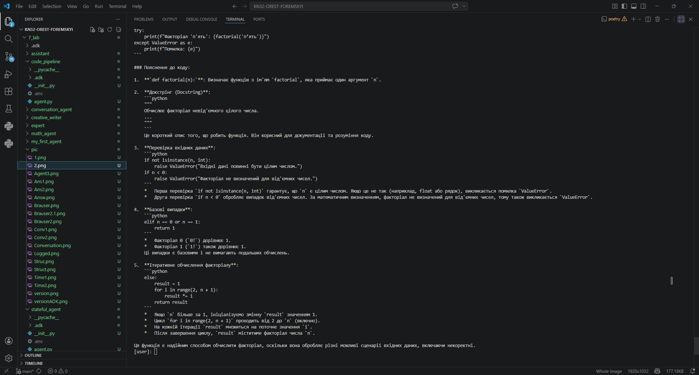

2. Переваги Sequential агента    

    Чітка логіка: Дозволяє розбити складне завдання на послідовність простих кроків.

    Передача контексту: Кожен наступний підагент отримує результати роботи попереднього, що забезпечує цілісність рішення.

    Спеціалізація: Кожен етап виконується вузькопрофільним «експертом», що підвищує загальну якість результату.


### Loop Agent - Циклічне виконання*;

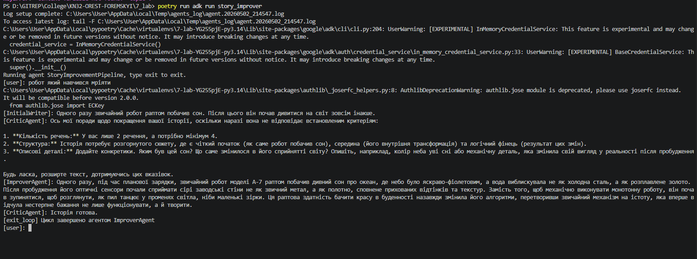

1. Механізм завершення циклу через exit_loop працює як логічний перемикач для агентів, що виконують ітераційні завдання.

    Функціональне призначення: exit_loop — це спеціальний інструмент (tool), який дозволяє агенту сигналізувати системі, що поставлена ціль досягнута або подальше виконання циклу неможливе.

    Принцип роботи: Коли агент викликає цю функцію, він передає фінальний результат як аргумент. Це перериває ітераційний процес і повертає цей результат користувачу.

    Умова виходу: На кожному кроці циклу агент аналізує проміжний результат. Якщо дані відповідають критеріям (наприклад, "текст достатньо якісний"), агент обирає виклик exit_loop замість наступної ітерації.

    Важливість для стабільності: Цей механізм запобігає нескінченним циклам та надмірному використанню токенів, забезпечуючи чітку точку зупинки за логікою самого AI.


### Parallel Agent - Паралельне виконання
1. Відповідь на запитання " Які останні тренди у технологіях? " 
```
Python
Основними нововведеннями у версіях Python 3.13 та 3.14 стали впровадження режиму роботи без глобального блокування інтерпретатора (free-threaded CPython) та значне вдосконалення JIT-компілятора для підвищення продуктивності. Також було покращено повідомлення про помилки та додано нові інструменти для статичної типізації, що робить мову ще ефективнішою для великих проектів.

Штучний інтелект
Ключовою тенденцією є перехід від гігантських моделей до спеціалізованих агентських систем та мультимодальних моделей, що здатні миттєво обробляти відео та аудіо в реальному часі. Активно розвиваються технології «Small Language Models» (SLM), які можна запускати локально на пристроях без втрати якості, а також концепція «AI-native» розробки ПЗ.

Веб-розробка
У веб-сфері домінують серверні компоненти (React Server Components) та фреймворки наступного покоління, такі як Next.js 15 та вдосконалений Astro, що фокусуються на мінімальному обсязі JavaScript на клієнті. Популярності набувають інструменти на базі Rust (наприклад, Turbopack), які значно прискорюють збірку проектів, та повна інтеграція AI-помічників у робочі процеси розробників.

Висновок
Сучасні технології рухаються у бік радикального підвищення продуктивності через JIT та Rust-інструменти, паралельно інтегруючи штучний інтелект у кожен рівень розробки та споживання контенту.
```


2. Переваги паралельного виконання

    Одночасна обробка: Головна перевага полягає в тому, що запити до API або пошукових систем надсилаються одночасно для всіх трьох напрямків (Python, AI, Web). Система не чекає завершення одного дослідження, щоб почати наступне.

    Оптимізація часу (Latency): Загальний час виконання всієї групи агентів дорівнює часу роботи найповільнішого з них, а не сумі часів усіх трьох.

    Приклад: Якщо кожне дослідження триває 10 секунд, то послідовно це займе 30 секунд, а паралельно — лише 10 секунд.

    Ефективне використання ресурсів: Паралельне виконання дозволяє максимально завантажити доступні канали зв'язку та обчислювальні потужності, що особливо важливо в агентських архітектурах, де багато часу витрачається на очікування відповіді від віддаленого сервера (I/O Bound завдання).
1. Створення власного Workflow агента:

``` Python
from google.adk.agents.parallel_agent import ParallelAgent
from google.adk.agents.sequential_agent import SequentialAgent
from google.adk.agents.loop_agent import LoopAgent
from google.adk.agents.llm_agent import Agent

MODEL = "gemini-3.1-flash-lite"

# --- ЕТАП 1: Паралельний збір даних (Parallel) ---
engine_expert = Agent(
    name="EngineExpert",
    model=MODEL,
    instruction="Досліди сучасні двигуни для кастомних байків. Надай список з 3 варіантів.",
    output_key="engine_data"
)

design_expert = Agent(
    name="DesignExpert",
    model=MODEL,
    instruction="Досліди тренди фарбування та дизайну рам у 2026 році. Надай 3 ідеї.",
    output_key="design_data"
)

parallel_research = ParallelAgent(
    name="DataGathering",
    sub_agents=[engine_expert, design_expert]
)

# --- ЕТАП 2: Послідовна обробка (Sequential) ---
writer = Agent(
    name="ReportWriter",
    model=MODEL,
    instruction="""
    На основі отриманих даних:
    Двигуни: {engine_data}
    Дизайн: {design_data}
    Склади чорновик звіту 'Концепт кастомного мотоцикла'.
    """,
    output_key="report_draft"
)

# Об'єднуємо збір та написання
sequential_pipeline = SequentialAgent(
    name="ProductionPipeline",
    sub_agents=[parallel_research, writer]
)

# --- ЕТАП 3: Цикл покращення (Loop) ---
def check_quality(report: str) -> bool:
    """Перевіряє, чи достатньо довгий та детальний звіт."""
    return len(report) > 500  # Вихід з циклу, якщо більше 500 символів

editor = Agent(
    name="ChiefEditor",
    model=MODEL,
    instruction="Переглянь звіт. Якщо він короткий, додай технічних деталей та метафор. Якщо добрий — виклич exit_loop.",
)

# Фінальний workflow з циклом
root_agent = LoopAgent(
    name="FinalWorkflow",
    sub_agent=sequential_pipeline,
    # Агент буде повторювати процес покращення, поки редактор не підтвердить якість
    exit_loop_tool=editor 
)
```
---
### Висновок:
> у висновку потрібно відповісти на запитання:

Що зроблено: Розроблено та протестовано інтелектуальних агентів з архітектурами Sequential, Parallel та Loop за допомогою фреймворку ADK.

Мета: Досягнута повністю.

Нові знання: Принципи оркестрації LLM-агентів, налаштування параметрів моделей (temperature, top_p) та обробка викликів інструментів.

Відповіді на питання: Так, усі аспекти розкрито.

Виконання завдань: Усі завдання виконано.

Складності: Обмеження квот API (Error 429).

Формат: зручна практика побудови логічних ланцюжків для ШІ.

Побажання: Додати в інструкції вирішення типових помилок з лімітами запитів.

---