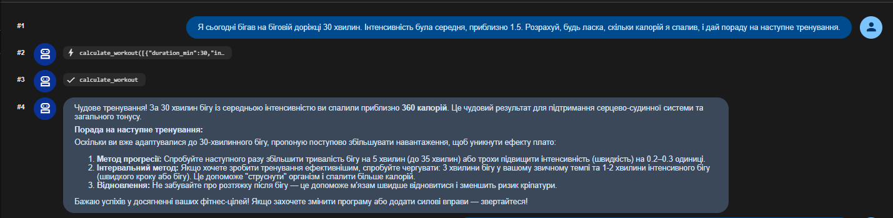
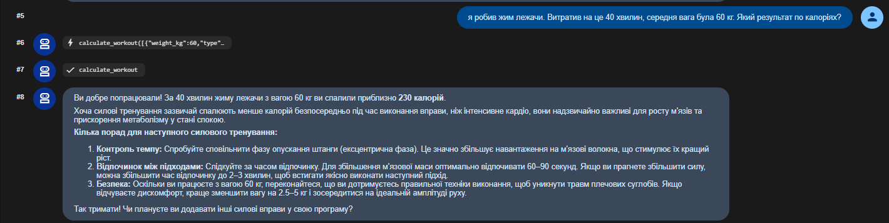
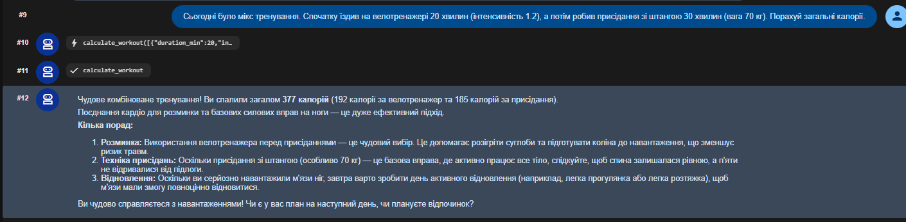

# Екзаменаційне завдання
**Варіант:** 7 (Агент фітнес-тренера)
**Опис:** AI-агент, який виконує роль персонального фітнес-тренера. Використовує OOP (4 парадигми) для створення системи обліку тренувань та інструмент `calculate_workout` для підрахунку витрачених калорій. Проект ініціалізовано через Poetry.

## Звіт:
1. Перший діалог  
    

1. Другий ділог 
    

1. Третій діалог    
